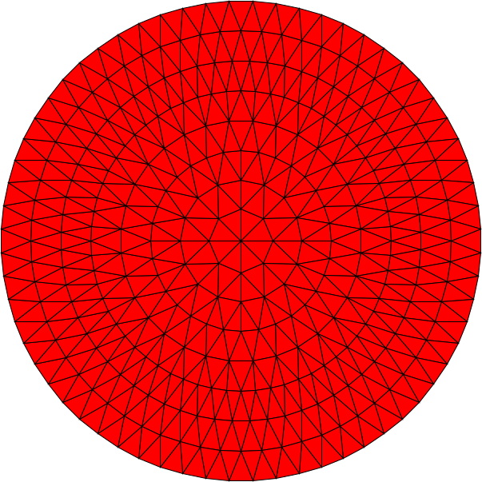
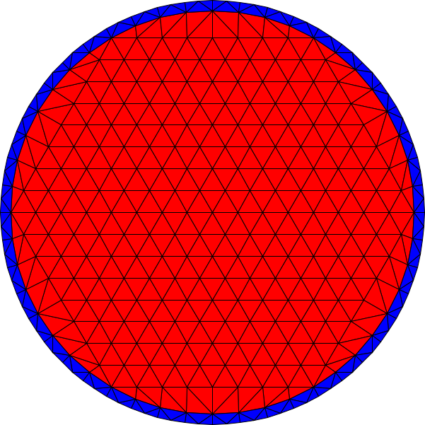
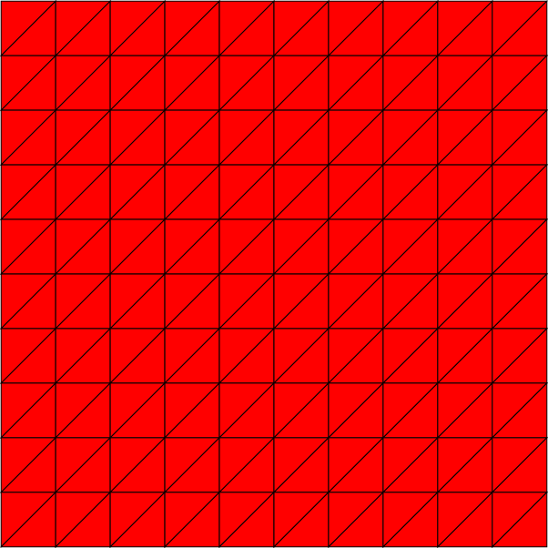
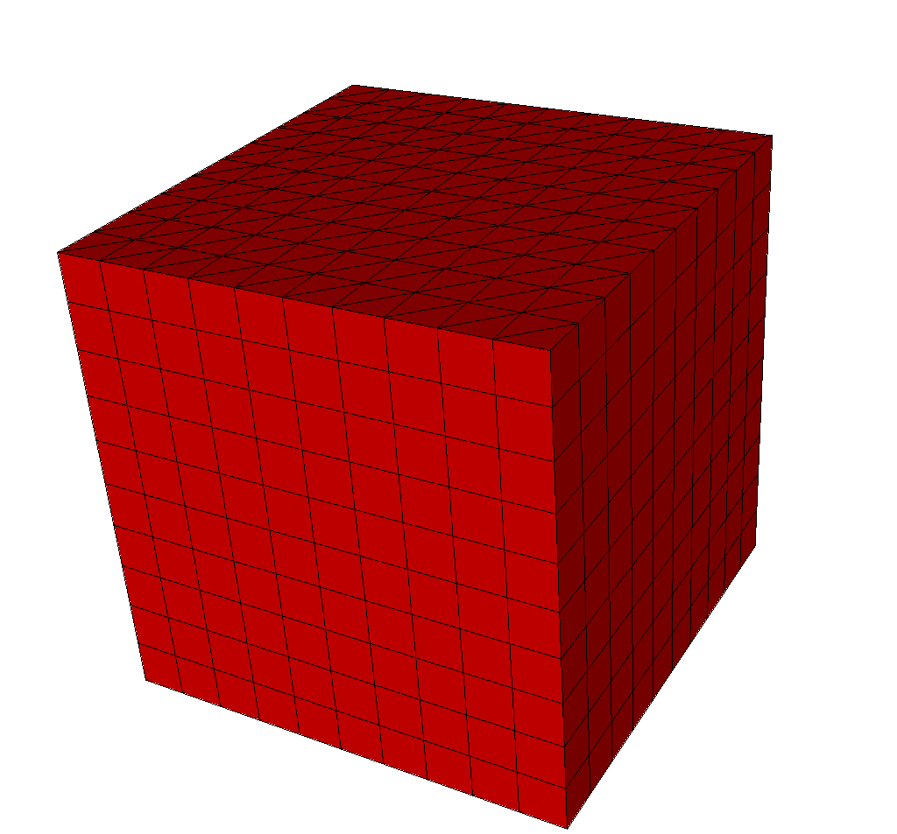
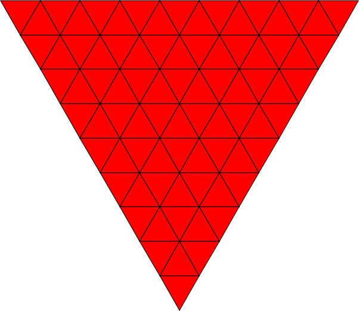
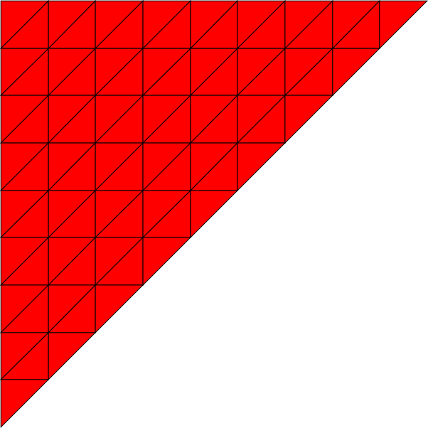
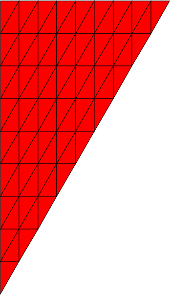
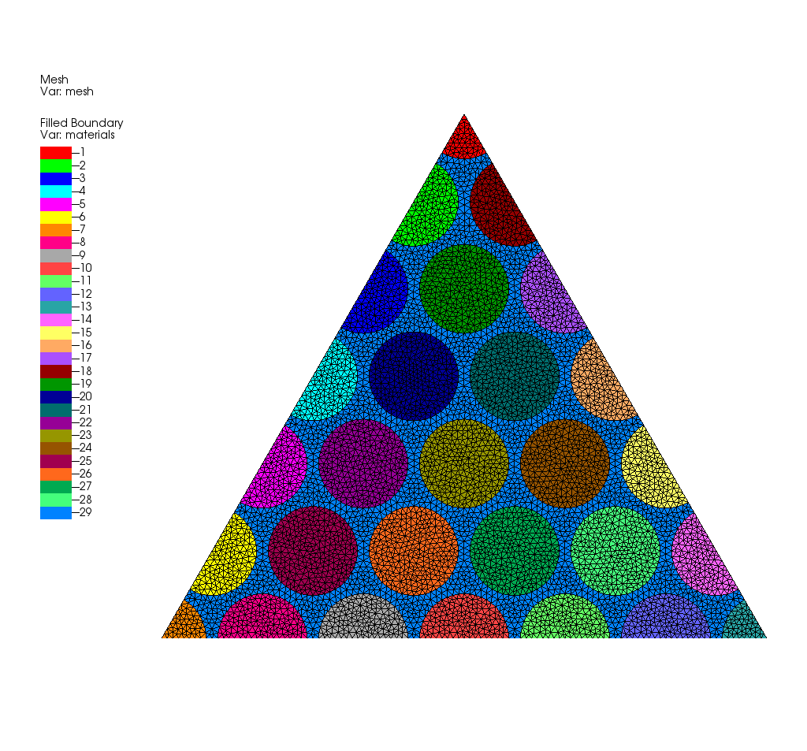
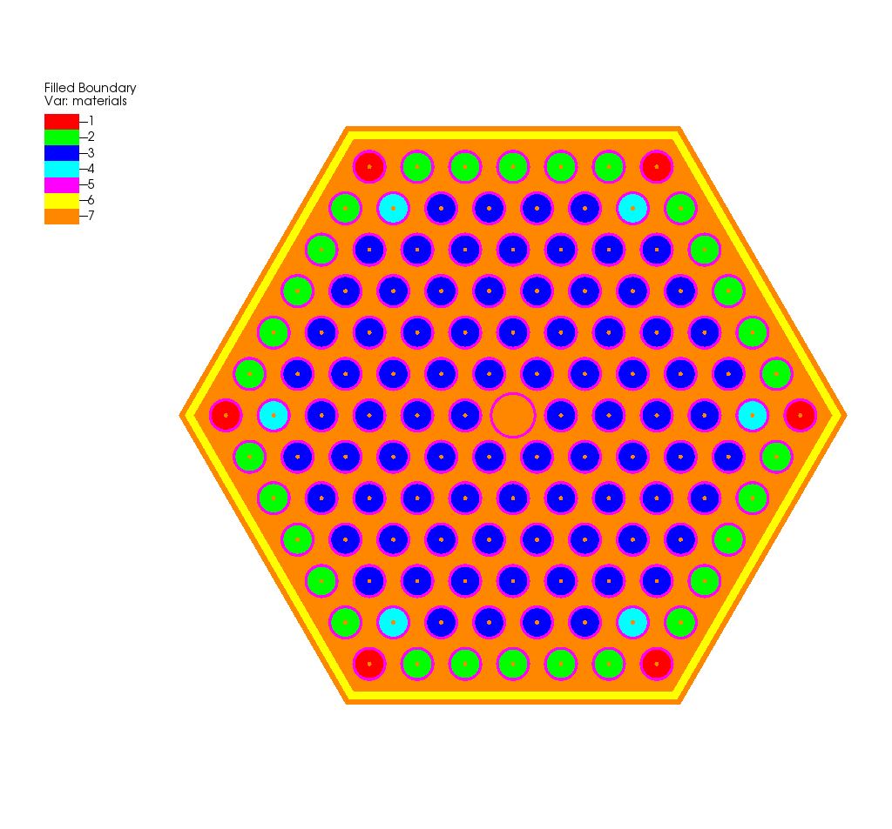

# MESHGEN Sample meshes

* pin1 - simple pincell mesh from meshgen/pinmesh utility

* pin2 - simple pincell mesh from meshgen/pinmesh utility

* square - simple square mesh from meshgen/square utility

* cube   - simple cube mesh from meshgen/square utility

* tri1 - simple square mesh from meshgen/triangle utility

* tri2 - simple square mesh from meshgen/triangle utility

* tri3 - simple square mesh from meshgen/triangle utility

# Advanced Sample meshes

* trilat6 - triangle lattice from gmsh/createtri and gmsh

* trilat24 - triangle lattice from gmsh/createtri and gmsh

* pwr  - PWR 17x17 mesh from gmsh/createhex and gmsh

* vver - VVER input from gmsh/createhex and gmsh

